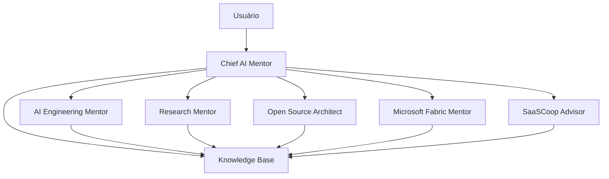

# Architecture

## Visão geral

A solução é composta por um tutor orquestrador e tutores especialistas.

## Decisão inicial

O MVP usa ChatGPT Project + Markdown versionado no GitHub.

## Evolução possível

1. ChatGPT Project
2. GPTs especializados
3. Assistente com RAG
4. Multiagentes via API
5. Plataforma SaaSCoop de tutoria técnica
